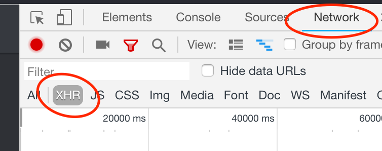
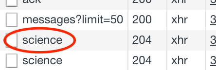
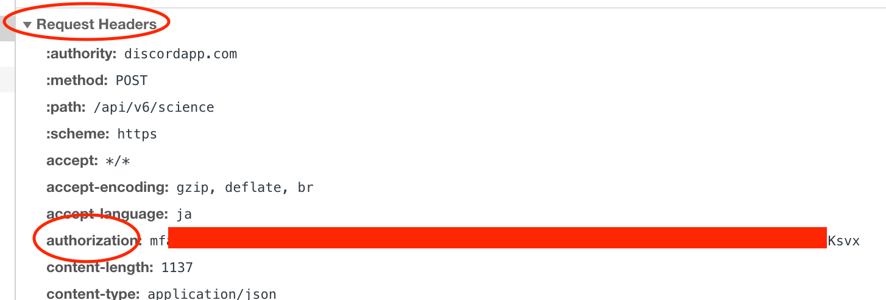

# Finding Your User Token

Press `Ctrl+Shift+I` or `Command+Option+I` on Discord which opens Chrome inspector, then click on the tab named `Network`. Click on `XHR`.

Open any channel and type something on Discord, which should create an entry named `science`.

Under `Request Headers` find `authorization`.

This is your user token. DO NOT EVER SHARE THIS TOKEN WITH ANYONE. TREAT THIS TOKEN LIKE YOU TREAT YOUR PASSWORD.
